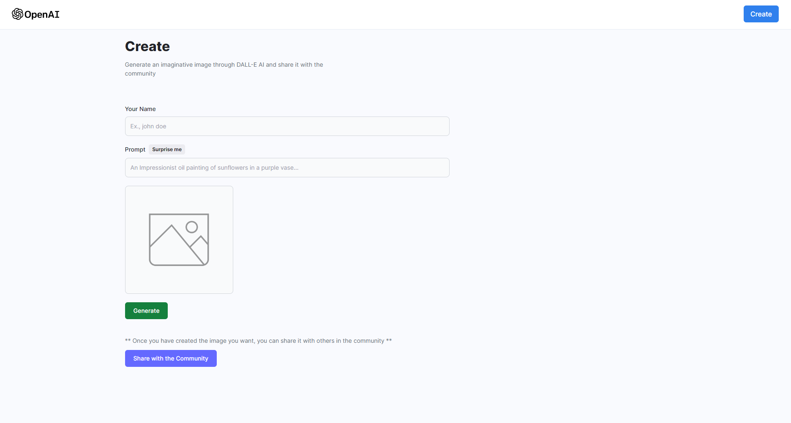
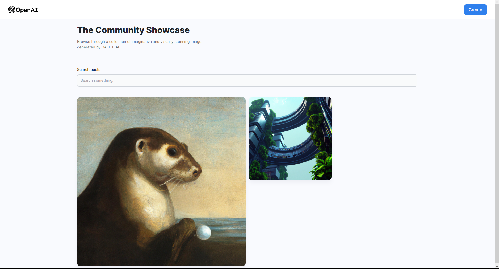

### This application is a clone of the Dalle AI application by OpenAI. It is a web application that allows users to upload images and generate images from them using the DALL-E model. The application is built using MERN stack and the backend is deployed on Render and the frontend is deployed on Netlify.
 
### The application is live at: https://custom-image-generator.netlify.app

### Some screenshots of the application:

